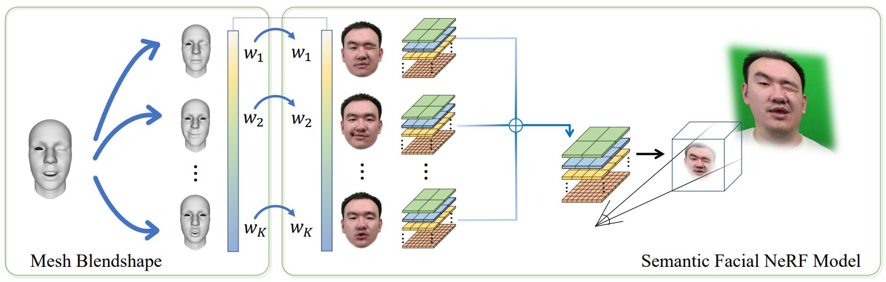
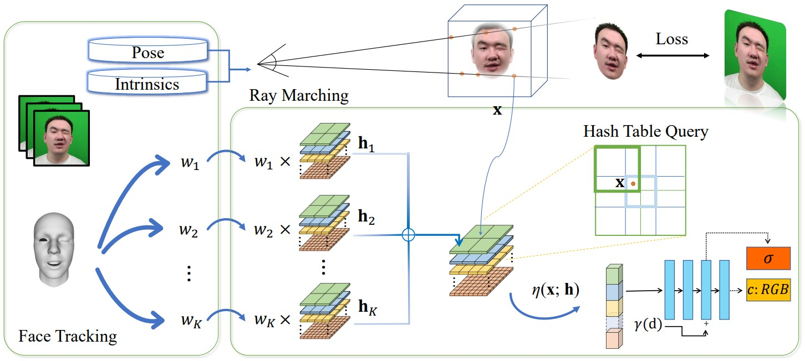

# Reconstructing Personalized Semantic Facial NeRF Models From Monocular Video

PyTorch implementation of the paper "Reconstructing Personalized Semantic Facial NeRF Models From Monocular Video". This repository contains the inference code, data and released pretrained model.

**|[Project Page](https://ustc3dv.github.io/NeRFBlendShape/)|[Paper](https://arxiv.org/abs/2210.06108)|**


We present a semantic model for human head defined with neural radiance field. In this model, multi-level voxel field is adopted as basis with corresponding expression coefficients, which enables strong representation ability on the aspect of rendering and fast training.

## Pipeline

We track the RGB sequence and get expression coefficients, poses and intrinsics. Then we use the tracked expression coefficients to combine multiple multi-level hash tables to get a hash table corresponding to a specific expression. Then the sampled point is queried in hash table to get voxel features, we use an MLP to interpret the voxel features as RGB and density. We fix the expression coefficients and optimize the hash tables and MLP to get our head model.



## Monocular RGB Video Data and Pretrained models

Some videos are from the dataset collected by [Neural Voice Puppetry](https://justusthies.github.io/posts/neural-voice-puppetry/) and [SSP-NeRF](https://alvinliu0.github.io/projects/SSP-NeRF). We also capture some monocular videos with exaggerated expressions and large head rotations. In each captured video, the subject is asked to perform arbitrary expressions. The last 500 frames serve as the testing dataset.

Download preprocessed data and pretrained models [here](https://drive.google.com/drive/folders/1OiUvo7vHekVpy67Nuxnh3EuJQo7hlSq1?usp=sharing), unzip them to the root dir of this project.

The folder structure is as follows:

```
dataset
├── id1
│   ├── id1.mp4 #the captured video
│   ├── max_46.txt #the maximum of the expression coefficients
│   ├── min_46.txt #the minimum of the expression coefficients
│   ├── pretrained.pth.tar #pretrained model 
│   └── transforms.json #intrinsics, poses and tracked expression coefficients
├── id2
│   ├── ...
...
```

## Setup

This code has been tested on RTX 3090. 

Install requirements.txt:

```
pip install -r requirements.txt
```

Install [PyTorch](https://pytorch.org/get-started/locally/) according to your OS and Compute Platform.

Install [tiny-cuda-nn](https://github.com/NVlabs/tiny-cuda-nn)

```
pip install git+https://github.com/NVlabs/tiny-cuda-nn/#subdirectory=bindings/torch
```

## Run the Inference Code

run

```
sh run.sh
```

in `run.sh` , you could change `$NAME`  to set specific subject id. The rendered result will be found in workspace folder `trial_$NAME`.  `xxx.png` is the facial reenactment result and `xxx_nvs.png` is novel view synthesis result.

You could use `generate_video.py` to convert rendered images into a video sequence.

## Citation

If you find our paper useful for your work please cite:

```
@article{Gao2022nerfblendshape,
         author = {Xuan Gao and Chenglai Zhong and Jun Xiang and Yang Hong and Yudong Guo and Juyong Zhang}, 
         title = {Reconstructing Personalized Semantic Facial NeRF Models From Monocular Video}, 
         journal = {ACM Transactions on Graphics (Proceedings of SIGGRAPH Asia)}, 
         volume = {41}, 
         number = {6}, 
         year = {2022}, 
         doi = {10.1145/3550454.3555501} }
```

## Acknowledgement

This code is developed on [torch-ngp](https://github.com/ashawkey/torch-ngp) code base. 

```
@misc{torch-ngp,
    Author = {Jiaxiang Tang},
    Year = {2022},
    Note = {https://github.com/ashawkey/torch-ngp},
    Title = {Torch-ngp: a PyTorch implementation of instant-ngp}
}
```
